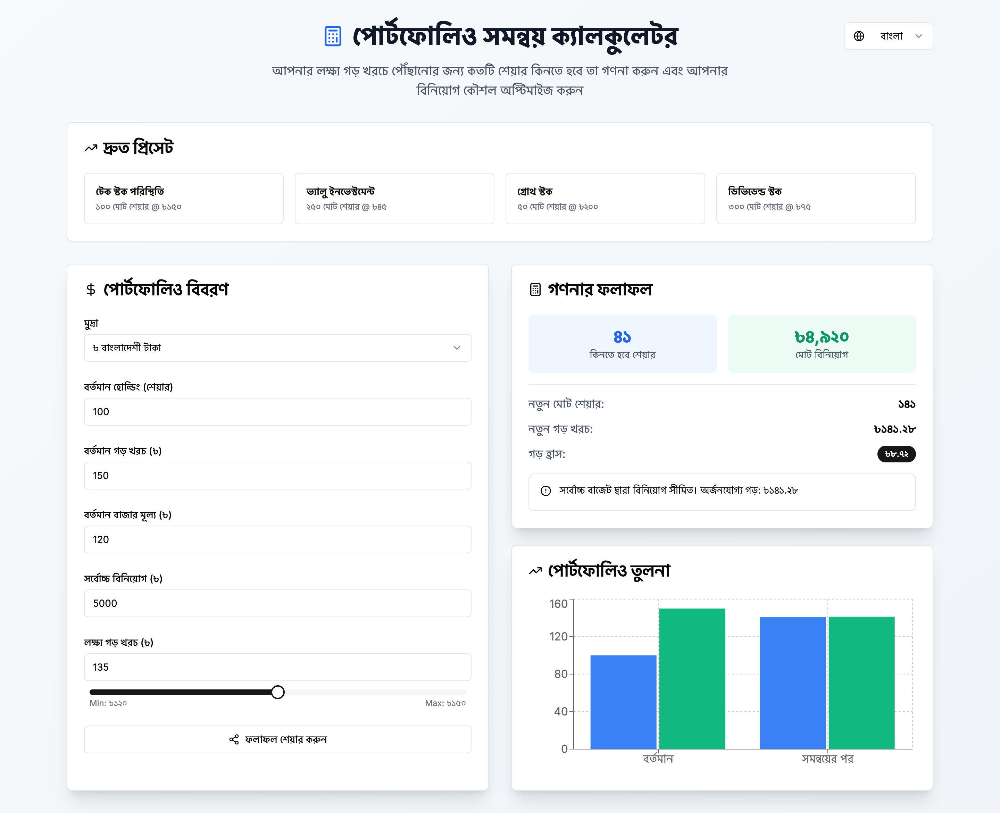

# Portfolio Adjustment Calculator

A modern, responsive web application that helps investors calculate the optimal number of shares to buy to reach their target average cost. Built with Next.js, TypeScript, and shadcn/ui.



## Features

- 🎯 Calculate optimal share purchases to reach target average cost
- 💰 Support for multiple currencies (BDT, USD, EUR, GBP, JPY, CAD, AUD, INR)
- 🌐 Bilingual support (English and Bangla)
- 📊 Interactive charts for portfolio comparison
- 📱 Fully responsive design
- 🎨 Beautiful, modern UI with dark mode support
- 🔗 Shareable calculation results via URL
- ⚡ Quick presets for common investment scenarios

## Tech Stack

- **Framework:** Next.js 15.3.3
- **Language:** TypeScript
- **UI Components:** shadcn/ui
- **Styling:** Tailwind CSS
- **Charts:** Recharts
- **Icons:** Lucide React
- **Form Handling:** React Hook Form
- **Validation:** Zod

## Getting Started

1. Clone the repository:
```bash
git clone https://github.com/heftysoft/Portfolio-Adjustment-Calculator.git
```

2. Install dependencies:
```bash
npm install
```

3. Run the development server:
```bash
npm run dev
```

4. Open [http://localhost:3000](http://localhost:3000) in your browser.

## Usage

1. Enter your current portfolio details:
   - Current holdings (number of shares)
   - Average cost per share
   - Current market price
   - Maximum investment amount
   - Select currency

2. Set your target average cost using the slider or input field

3. View the calculation results:
   - Number of shares to buy
   - Total investment required
   - New average cost
   - Portfolio comparison chart

4. Share your calculation results using the share button

## Development

- `npm run dev` - Start development server
- `npm run build` - Build for production
- `npm run start` - Start production server
- `npm run lint` - Run ESLint

## Contributing

Contributions are welcome! Please feel free to submit a Pull Request.

## License

This project is licensed under the MIT License - see the [LICENSE](LICENSE) file for details. 